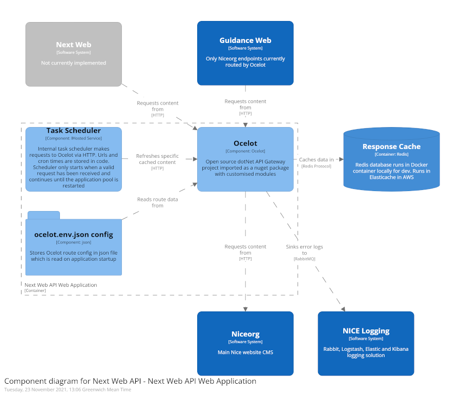

# Next Web API

> Ocelot API Layer for Next Web / Guidance Web

<details>
<summary><strong>Table of contents</strong></summary>
<!-- START doctoc -->
- [Ocelot API Layer](#ocelot-api-layer)

- [Next Web API](#next-web-api)
	- [What is it?](#what-is-it)
	- [Stack](#stack)
		- [Software](#software)
		- [Diagram](#diagram)
	- [Local development setup](#local-development-setup)
		- [.Net Core Locally stored secrets](#net-core-locally-stored-secrets)
	- [Overview](#overview)
		- [Ocelot](#ocelot)
		- [Task Scheduler](#task-scheduler)
		- [X-CacheManager-RefreshCache Header](#x-cachemanager-refreshcache-header)
		- [Route config](#route-config)
		- [Ocelot Pipeline](#ocelot-pipeline)
		- [Redis cached content keys](#redis-cached-content-keys)
			- [Redis Key naming](#redis-key-naming)
			- [Key Generation Admin tool](#key-generation-admin-tool)
			- [Redis Key storage](#redis-key-storage)
			- [Enhanced Ocelot Logging](#enhanced-ocelot-logging)
	- [Gotchas](#gotchas)
		- [Redis SSL Connection](#redis-ssl-connection)
		- [Running Redis on Docker - memory errors](#running-redis-on-docker---memory-errors)
		- [Secrets.json](#secretsjson)

<!-- END doctoc -->
</details>

## What is it?

Next Web API is a Redis backed .dotnet Core app which provides transparent read through caching for some aspects Guidance Web and (in the future) Next Web. It uses the Ocelot framework as a base with minimal modifications. It also provides last know good for cached content (depending on the config) which in turn will enhance the availability of dependant systems.

## Stack

### Software

- [Visual Studio 2019](https://visualstudio.microsoft.com/vs/)
- [.NET Core 3.1 LTS](https://dotnet.microsoft.com/)
- [xUnit](https://xunit.net/) for tests
- [Ocelot](https://ocelot.readthedocs.io/) API Framework
- [CacheManager](https://cachemanager.michaco.net/) Caching framework form Ocelot
- [Redis](https://redis.io/) Key/Value store for CacheManager
- [ElastiCache](https://aws.amazon.com/elasticache/) AWS Managed Redis service
- [Docker](https://redis.io/) To run Redis locally for dev purposes

### Diagram



## Local development setup

1. Clone next-web project to local machine
1. Open NICE.NextWeb.API project in Visual Studio 2019
1. Restore nuget packages
1. Restore locally stored secrets see [.Net Core Locally stored secrets](#.Net-Core-Locally-stored-secrets)
2. To run Redis locally start docker using the command ```docker-compose up```

### .Net Core Locally stored secrets

Secrets and sensitive information can be stored locally in a file outside of a projects source control using the built in Secrets feature of .Net Core. More information can be found here [https://docs.microsoft.com/en-us/aspnet/core/security/app-secrets?tabs=windows&view=aspnetcore-3.1](https://docs.microsoft.com/en-us/aspnet/core/security/app-secrets?tabs=windows&view=aspnetcore-3.1)

Individual values/objects can be stored in a file located in the dev users' profile (on Windows) or in home directory on Linux. This file can be easily managed using "Manage user secrets" feature in Visual Studio. This can be found by in the menu which is displayed by right clicking on the project in solution explorer. This will open up secrets.json. Initially it is best to obtain this file from another dev.

In the production environment (dev, test, alpha, beta, live) the config is read from ocelot.production.json. This file has the secrets stored as Octopus variables which are replaced as part of the deployment process.

## Overview

### Ocelot

Ocelot is used by this project to provide basic API Gateway functionality. More information can be found here [Ocelot](https://ocelot.readthedocs.io/). This project is using version Ocelot 16.0.1 which is the highest version that supports .Net Core 3.1 LTS.

Ocelot is loaded from Nuget packages with some minor customisations. Mainly a custom Cache Manager is injected into the service collection. This custom Cache Manager is default except it inspects headers for the X-CacheManager-RefreshCache header which is described [here](#x-cachemanager-refreshcache-header).

Additionally some convenience configuration extension functions are provided to configure Ocelot and CacheManager.

### Task Scheduler

An internal component which provides scheduling services to enable the refreshing of specific content in the cache. It uses the .Net IHosted service interface which runs in the background continuously once the app has started. The app only fully starts once its receives a HTTP request. If the application pool restarts then the scheduler stops until another HTTP request wakes the program up. The app pool is set to reset each night at 00:30am. This means that for environments that aren't frequently used the scheduler will stop running until another request comes in. The refresh task is optional and isn't needed for a url to be cached (any url specified in the route config will be cached). To refresh a cached item a HTTP client is used to make a standard HTTP GET request with the addition of a specific header noted [here](#x-cachemanager-refreshcache-header)

### X-CacheManager-RefreshCache Header

If X-CacheManager-RefreshCache header is present on an incoming request Ocelot will not attempt to load the content from cache first. It will load the content from the downstream host. This content will then stored in cache replacing existing content). This is useful as it will provide a method to warm the cache up and also maintain it in a warm/hot state.

If X-CacheManager-RefreshCache is not present on an incoming request the content is loaded from cache first and if not present in cache it will be loaded from the downstream host (and then stored in cache). Such a request would be a general request from an end user.

Only successful HTTP (with HTTP status code 200) downstream requests are persisted to the cache.

### Route config

Routes are stored in ocelot.production.json and ocelot.development.json depending on the environment. More info on how to specify routes [here]([https://ocelot.readthedocs.io/en/latest/features/routing.html). These are loaded at application startup time.

### Ocelot Pipeline

Ocelot is a modified .Netcore Web Application pipeline. Each component of the pipeline is injected using .Netcore Dependency injection and therefore can be overridden. Next Web API overrides the caching module to add 2 extra features.

1. Refresh cache using a header - this allows us to refresh the cache from a simple https request without waiting for the TTL to run out. This can be trigged internally by using the internal [Task Scheduler](#task-scheduler) or by simply making a http request with the correct header
2. Don't cache errors (or anything other than status 200) - if a request fails then the resulting error content isn't stored in the cache. This means that the last known good content is always served from cache.

### Redis cached content keys

Requests are handled the Ocelot pipeline by various stages. Ocelot Cache Manager is one such stage. This stage uses the similarly named [CacheManager](https://cachemanager.michaco.net/) to implement the basic caching features. CacheManager in turn uses [StackExchange.Redis](https://stackexchange.github.io/StackExchange.Redis/) as a client for Redis.

#### Redis Key naming

A request comes in and a MD5 hash is generated from the requested URL along side the HTTP method. In the following way...

GET Request on URL: `https://my.test.url/api/dummy-data`

Cache key: `GET-https://my.test.url/api/dummy-data`

MD5 Encoded cache key: `3FF7D3A1413B5BD9078F06684D4E87CF` (as you can see this is totally different to the above value despite only one character being different)

**Warning**
MD5 Hash functions generate totally different values even if one character is different (they are also case sensitive)

GET Request on URL `http://my.test.url/api/dummy-data`

Cache key `GET-http://my.test.url/api/dummy-data`

MD5 Encoded cache key `D08EB3CB559F04B3E176FF6114FC85B1`

This MD5 value is then used as the key name for the cached content.

#### Key Generation Admin tool

If the API is running in pre-prod mode (set via environment var) then you can access a tool to generate key names. This is useful for diagnostic purposes. The url is:-
`/admin/CacheKeyGenerator`

#### Redis Key storage

Cached items are stored as [Redis hashes](https://redis.io/topics/data-types#hashes) which are able to store a set of key value pairs. The name of the key is the MD5 encoded url [as noted here](#redis-key-naming).

#### Enhanced Ocelot Logging

To enable enhanced logging for Ocelot upstream and downstream requests, set the EnableEnhancedOcelotLogging option in your appsettings.json file. This feature can be toggled on or off dynamically using Octo. By default, this setting is disabled (false) to avoid unnecessary performance overhead, especially in live production environments. Enhanced logging is intended for development or troubleshooting scenarios where detailed request and response information is required.

The output from enhanced logging is written to the standard logging stack and can be filtered using the "LogType" field. This field will have one of the following values:

- UpstreamRequests
- DownstreamRequests
- DownstreamRequestBody

These values align with Ocelot's terminology for incoming and outgoing traffic as defined in its documentation.

## Gotchas

### Redis SSL Connection

When running Redis locally TLS is not configured by default. However in AWS Elasticache it is turned on by default in versions higher than 6. To enable SSL connections use the change the RedisConnectionString entry in appsettings.json to  `SSL=True`

### Running Redis on Docker - memory errors

If you encounter out of memory errors when starting up the docker-compose config for the local Redis instance you will need to make a change to the Docker virtual machine. This only occurs when you are running the Docker virtual machine in WSL 2.

You need to connect to your Docker virtual machine in using a Powershell command window. Then you need to modify a systemmd property on the Docker virtual machine (which is running linux)

1. Run this command in Powershell

 ```
 wsl -d docker-desktop
 ```

2. You will then be at the bash prompt of the Docker engine (which is a WSL 2 vm). This should look something like this.

 ```
 {your hostname}/tmp/docker-desktop-root/mnt/host/c/Users/{your username}#
 ```

3. Run

 ```
 sysctl -w vm.overcommit_memory=1
 ```

This will change the engine.overcommit_memory property and it will apply it immediately. For some reason the change isn't persisted so you may find you need to reapply this after you reboot your host machine or the Docker engine vm.

### Secrets.json

By default when running in "Development" mode (which is set via environment variables or via Visual Studio debug configuration) the .Net core host loads configuration from locally stored secrets. Please ensure you have this configured correctly. You may need to get this config from another dev who has recently worked on this. More information can be found [here](https://docs.microsoft.com/en-us/aspnet/core/security/app-secrets?view=aspnetcore-3.1&tabs=windows).
